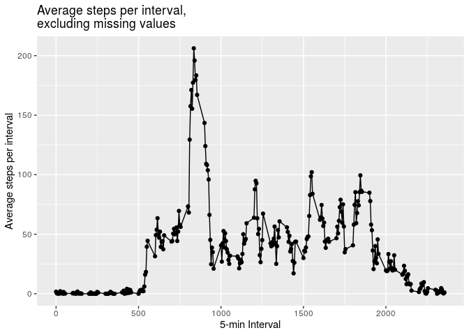

## Loading and preprocessing the data


1. Load the data 
2. Process/transform the data into a format suitable for your analysis. Here I convert "date" to R date format and convert data frame into a tibble.


```r
#read in data
mydata <- read.table(unz("activity.zip", "activity.csv"), header=T, sep = ",")
#convert date into date format
mydata$date <- as.Date(mydata$date)
#convert to tibble
mydata <- as_tibble(mydata)
#look at data
mydata
```

```
## # A tibble: 17,568 x 3
##    steps date       interval
##    <int> <date>        <int>
##  1    NA 2012-10-01        0
##  2    NA 2012-10-01        5
##  3    NA 2012-10-01       10
##  4    NA 2012-10-01       15
##  5    NA 2012-10-01       20
##  6    NA 2012-10-01       25
##  7    NA 2012-10-01       30
##  8    NA 2012-10-01       35
##  9    NA 2012-10-01       40
## 10    NA 2012-10-01       45
## # … with 17,558 more rows
```


## What is mean total number of steps taken per day?

1. Calculate the total number of steps taken per day. Ignore missing values.
2. Make a histogram of the total number of steps taken each day.


```r
#calculate total steps per day, excluding missing data
mydata_day <- mydata %>% 
  group_by(date) %>%
  #total steps per day
  summarise(total.steps=sum(steps,na.rm=TRUE)) %>%
  #remove days with no steps (due to missing data) to make cleaner     histogram
  filter(total.steps > 0)

#make histogram of steps per day
plot_hist <- ggplot(data=mydata_day,
  aes(total.steps)) + 
  geom_histogram(bins=30,boundary = 0) + 
  xlab("Total steps per day") + 
  ylab("Days") + 
  ggtitle("Histogram of total steps per day\nexcluding missing values") +
  ylim(c(0,15))

print(plot_hist)
```

<!-- -->

3. Calculate and report the mean and median of the total number of steps taken per day


```r
mydata_day_summary <- 
  mydata_day %>%
  summary(total.steps) %>% 
  gsub(":","total steps per day (missing values excluded):",.)

str_squish(mydata_day_summary[,2][3:4])
```

```
## [1] "Median total steps per day (missing values excluded):10765"
## [2] "Mean total steps per day (missing values excluded):10766"
```

## What is the average daily activity pattern?

1. Make a time series plot of the 5-minute interval (x-axis) and the average number of steps taken, averaged across all days (y-axis).


```r
#get mean steps per interval over all days
mydata_time <- 
  mydata %>% 
  group_by(interval) %>%
  summarise(mean.steps=mean(steps,na.rm=TRUE)) %>%
  tibble::rownames_to_column()

plot_time <- ggplot(data=mydata_time,
  aes(x=interval, y=mean.steps)) + 
  geom_line()+
  geom_point() + 
  xlab("5-min Interval") + 
  ylab("Average steps per interval") + 
  ggtitle("Average steps per interval,\nexcluding missing values")
print(plot_time)
```

<!-- -->

2. Which 5-minute interval, on average across all the days in the dataset, contains the maximum number of steps?


```r
#get interval with max steps
max_mean_steps <- mydata_time[which(mydata_time$mean.steps==max(mydata_time$mean.steps)),c("interval")][[1]]

#get rough idea of time this interval corresponds to  
max_mean_steps_time <- 
  ((which(mydata_time$mean.steps == max(mydata_time$mean.steps)))*5)/60

if(max_mean_steps_time<12) {
  amorpm <- "am"
  max_mean_steps_hour <- max_mean_steps_time
} else {
  amorpm <- "pm"
  max_mean_steps_hour <- max_mean_steps_time-12
}
```

Interval with maximum number of steps per day is 835. This corresponds to an interval between 8 and 9 am.

## Imputing missing values

1. Calculate and report the total number of missing values in the dataset.

```r
num_miss<-nrow(mydata[is.na(mydata$steps),])
```

There are 2304 missing values in the dataset.

2. Devise a strategy for filling in all of the missing values in the dataset. Here I use the mean for each 5-minute interval, since activity appears to vary more by interval than by day.
3. Create a new dataset that is equal to the original dataset but with the missing data filled in.
4. Make a histogram of the total number of steps taken each day. Plot next to original histogram to make comparison easier.


```r
#impute steps by mean of each interval
mydata_imputed <- 
  mydata %>% 
  group_by(interval) %>%
  mutate(steps=ifelse(is.na(steps), mean(steps, na.rm=TRUE), steps)) %>%
  ungroup()

mydata_imputed_steps <-  
  mydata_imputed %>% 
  group_by(date) %>%
  summarise(total.steps=sum(steps))

#make histogram of steps per day
imputed_plot_hist <- ggplot(data=mydata_imputed_steps,
  aes(total.steps)) + 
  geom_histogram(bins=30,boundary = 0) + 
  xlab("Total steps per day") + 
  ylab("Days") + 
  ggtitle("Histogram of total steps per day\nwith missing values imputed") +
  ylim(c(0,15))

#plot both versions of histogram (imputing and excluding missing data) side by side to compare
grid.arrange(imputed_plot_hist,plot_hist,nrow = 1)
```

<!-- -->

The distributions of mean total steps per day are very similar with and without imputation of missing values. With imputation, more days have mean total steps closer to the overall mean, resulting in a slightly tighter distribution.  

Calculate and report the mean and median total number of steps taken per day. 


```r
#mean and median total steps per day
new_mydata_day_summary <- 
  mydata_imputed_steps %>%
  summary(total.steps) %>% 
  gsub(":","total steps per day (missing values imputed):",.)

#plot both versions of mean/median (imputing and excluding missing data) to compare
str_squish(new_mydata_day_summary[,2][3:4])
```

```
## [1] "Median total steps per day (missing values imputed):10766"
## [2] "Mean total steps per day (missing values imputed):10766"
```

```r
str_squish(mydata_day_summary[,2][3:4])
```

```
## [1] "Median total steps per day (missing values excluded):10765"
## [2] "Mean total steps per day (missing values excluded):10766"
```

Similarly, the mean and median total steps per day across all days are very similar with and without imputation of missing values. 

## Are there differences in activity patterns between weekdays and weekends?

1. Create a new factor variable in the dataset with two levels – “weekday” and “weekend” indicating whether a given date is a weekday or weekend day.
2. Make a panel plot containing a time series plot of the 5-minute interval (x-axis) and the average number of steps taken, averaged across all weekday days or weekend days (y-axis). 


```r
#make a variable that labels day as weekday or weekend
#calculate mean steps per interval for weekends and weekdays separately
mydata_imputed_days<-
  mydata_imputed %>%
  mutate(day=weekdays(date)) %>%
  mutate(day=str_replace_all(day,c("Monday" = "Weekday", "Tuesday" = "Weekday", "Wednesday" = "Weekday","Thursday" = "Weekday","Friday" = "Weekday","Saturday" = "Weekend","Sunday" = "Weekend"))) %>%
  group_by(day,interval) %>%
  summarise(mean.steps=mean(steps,na.rm=TRUE))

#plot average steps per interval for weekdays and weekends
plot_dayofweek <- ggplot(data=mydata_imputed_days,
  aes(x=interval, y=mean.steps)) + 
  geom_line()+
  geom_point() + 
  facet_grid(day~.) +
  xlab("Interval") + 
  ylab("Average steps per interval") + 
  ggtitle("Average steps per interval,\nwith missing values imputed")
print(plot_dayofweek)
```

<!-- -->

On weekdays, there is more activity (more steps) in the early morning than on weekends. On weekends, there is slightly more activity through the day than on weekdays.
